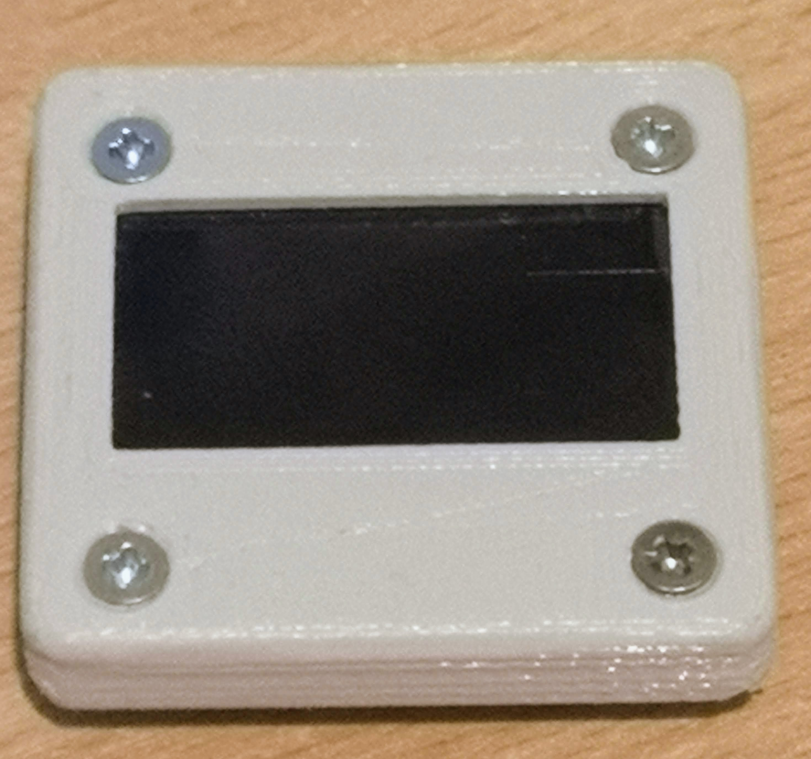

# Bezel for the AZ-Delivery 1.3" I2C OLED Display
A bezel and pressure pad for the AZ-Delivery 1.3" I2C OLED display (https://www.az-delivery.de/products/1-3zoll-i2c-oled-display), which is used at the new AMSAT-DL QO-100 DownConverter V3d.
Created with FreeCAD 0.18 (https://www.freecadweb.org/).

Easy to mount on a front panel with four 3mm holes for the mounting screws and four to five 3..4mm holes for the ribbon cable connector. 

Pay attention to print the pressure pad with the flex foil cavity heading upwards.

## V2 Recessed screws and tighter fit

Having purchased https://www.amazon.co.uk/gp/product/B07FYG8MZN I found the printed bezel to have a bit of a gap between the screen and bezel, I also wanted to use countersunk screws. The V2 version adds these changes. The screws are M2.5 x 12mm which allow for mounting onto a panel up to 3mm thick.

Copyright (C) 2019 by Thorsten Godau (dl9sec) and licensed under GNU GPL v3.0, https://www.gnu.org/licenses/gpl.html.

### V2
